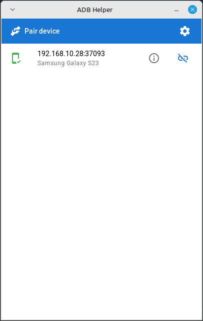
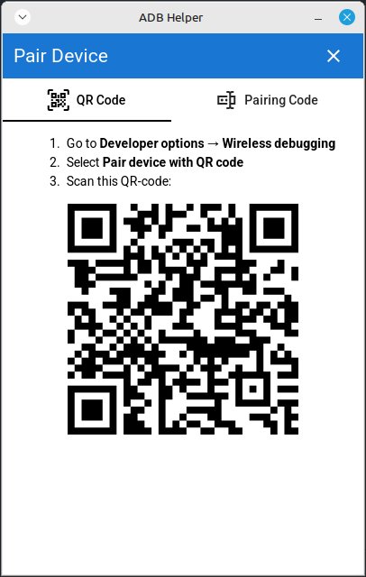

# ADB Helper

Desktop app aimed to simplify some routine ADB operations.

Initially developed to simplify Wireless debugging (searching, pairing and connecting devices) without Android Studio.
But I plan to implement more features. Feel free to create an issue if you want some feature to be implemented sooner.

Also check out my CLI tool with similar features: https://github.com/downace/adb-helper-cli

## Installation

### Pre-built binaries

Download from [Releases](https://github.com/downace/adb-helper-desktop/releases) page

### Manual build

1. Install Wails CLI: https://wails.io/docs/gettingstarted/installation
2. Clone or download this repository
3. Run `wails build`

## Screenshots

 
